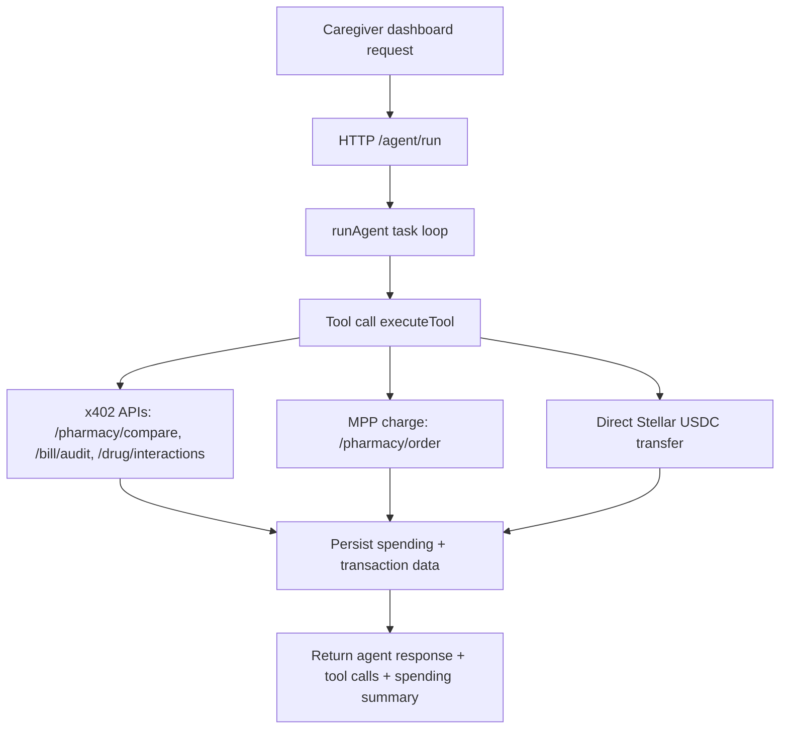

# CareGuard

**An autonomous AI agent that helps caregivers manage elderly healthcare spending on Stellar testnet.**

CareGuard compares medication prices, audits medical bills for errors, checks drug interactions, and executes payments only within carefully defined caregiver spending policies.

## Table of contents

- [Caregiver overview](#caregiver-overview)
- [The problem CareGuard solves](#the-problem)
- [How CareGuard works](#how-careguard-works)
- [Use case: Maria & Rosa](#use-case-maria--rosa)
- [Quick links](#quick-links)
- [Developer docs and architecture](#developer-docs-and-architecture)
- [Verified results](#verified-results)
- [Why CareGuard](#why-careguard)
- [Market context](#market-context)
- [License](#license)

---

## Caregiver overview

CareGuard is built to reduce the stress, time, and financial risk of managing health costs for an aging loved one.

It helps a caregiver:

- compare medication prices across nearby pharmacies
- catch billing mistakes before paying a hospital or provider bill
- check for harmful drug interactions before a refill is approved
- set spending limits that the agent cannot exceed
- review every transaction in a clear activity log

The product is designed around a simple principle: the agent helps with decisions, but the caregiver stays in control.

---

## The problem

**63 million American caregivers** spend $7,200/year out of pocket and 27 hours/week managing their aging parents' healthcare:

- Same medication costs **10x different** at pharmacies 2 miles apart
- **80% of medical bills** contain errors — average $1,300 overcharge on bills over $10K
- Only **0.1%** of denied insurance claims get appealed
- **71% of caregivers** are financially struggling

There is no tool that autonomously discovers the cheapest options, catches billing errors, and handles payments — with guardrails a caregiver can trust.

---

## How CareGuard works

CareGuard is an AI agent with a Stellar wallet that acts on behalf of a family caregiver:

1. **Compares medication prices** across pharmacies and checks for the lowest cost option
2. **Checks drug interactions** before ordering or approving medication
3. **Orders medications** from the cheapest verified pharmacy
4. **Audits medical bills** for duplicates, upcoding, and other overcharges
5. **Pays corrected bill amounts** only when the policy allows it
6. **Enforces spending policies** — daily/monthly limits, category budgets, and caregiver approval thresholds

Every payment is a real Stellar testnet transaction verifiable on [stellar.expert](https://stellar.expert/explorer/testnet).

For the full runtime flow, module map, and integration details, see [docs/ARCHITECTURE.md](docs/ARCHITECTURE.md).



### Payment protocols used

| Protocol | Purpose | How it works |
|----------|---------|--------------|
| **x402** | Agent pays for API queries (pharmacy prices, bill audits, drug interactions) | Agent calls x402-protected endpoint → gets 402 → signs Stellar auth entry → OZ Facilitator settles payment → agent receives data |
| **MPP Charge** | Agent pays pharmacies for medication orders | Agent orders medication → gets 402 challenge → signs Stellar payment tx → server broadcasts → order confirmed |
| **Stellar USDC transfer** | Agent pays medical bills | Agent builds Stellar payment tx → signs with keypair → submits to Horizon → USDC transferred |

### Services

| Service | Port | Protocol | Price |
|---------|------|----------|-------|
| Pharmacy Price API | 3001 | x402 | $0.002/query |
| Bill Audit API | 3002 | x402 | $0.01/audit |
| Drug Interaction API | 3003 | x402 | $0.001/check |
| AI Agent | 3004 | REST | — |
| Pharmacy Payment | 3005 | MPP Charge | per-order |
| Dashboard | 3000 | Next.js | — |

---

## Use case: Maria & Rosa

> Maria lives 800 miles from her 78-year-old mother Rosa. Rosa takes 4 medications from 3 pharmacies. Last month, Rosa's blood pressure medication cost $47 at CVS — $12 at Costco, 2 miles away. Nobody knew.
>
> Rosa's hospital sent a $2,500 bill with $1,195 in errors — duplicate charges and upcoded procedures. Rosa would have paid it.
>
> **CareGuard found $69.76/month in medication savings and caught $1,195 in billing errors — for $0.03 in agent API costs.**

---

## Quick links

- [Getting started guide for caregivers](docs/guides/getting-started-caregiver.md)
- [Caregiver FAQ](docs/guides/faq.md)
- [Quick start setup guide](QUICKSTART.md)
- [Architecture overview](docs/ARCHITECTURE.md)
- [Spending policy for caregivers](docs/guides/spending-policy-for-caregivers.md)
- [Spending policy technical reference](docs/SPENDING-POLICY.md)
- [Category budget examples](docs/guides/category-budgets-examples.md)
- [Testnet explained for caregivers](docs/guides/testnet-explained.md)
- [Using the /docs API explorer](docs/api-examples/using-the-docs-ui.md)
- [OpenAPI spec](docs/openapi.yml)

---

## Developer docs and architecture

The developer-facing setup and runtime details live in these focused guides:

- [QUICKSTART.md](QUICKSTART.md) — local environment setup, wallets, env vars, and starting the stack
- [docs/ARCHITECTURE.md](docs/ARCHITECTURE.md) — runtime flow, module boundaries, integrations, and data model
- [docs/SPENDING-POLICY.md](docs/SPENDING-POLICY.md) — how daily/monthly limits and category budgets are enforced
- [docs/api-examples/using-the-docs-ui.md](docs/api-examples/using-the-docs-ui.md) — how to browse the `/docs` Scalar API explorer

### Local quick start

```bash
# 1. Clone and install
git clone https://github.com/harystyleseze/careguard
cd careguard
npm install --legacy-peer-deps

# 2. Create testnet wallets
npm run setup

# 3. Configure .env (see .env.example)
cp .env.example .env
# Add: OZ_FACILITATOR_API_KEY, LLM_API_KEY, fund agent with testnet USDC

# 4. Start all services
npm run dev

# 5. Start dashboard (separate terminal)
cd dashboard && npm run dev

# 6. Open http://localhost:3000
```

### Docker development

For a single-command boot of the full stack — server, dashboard, redis, prometheus, and grafana — use Docker Compose:

```bash
# 1. Configure .env (same as above)
cp .env.example .env

# 2. Start everything
docker compose up

# 3. Open the apps
#   Dashboard:  http://localhost:3000
#   Server:     http://localhost:3004
#   Prometheus: http://localhost:9090
#   Grafana:    http://localhost:3030  (admin / admin by default)
#   Redis:      localhost:6379
```

The default `docker-compose.yml` builds the production-shape multi-stage images. The auto-loaded `docker-compose.override.yml` swaps the `server` and `dashboard` services for hot-reload dev mode.

See [docs/observability/health-checks.md](docs/observability/health-checks.md) for the `/health` and `/ready` response schemas and what each dependency check means.

For a symptom-to-resolution index (stuck agent spinner, repeated 402s, blank wallet balance, dashboard "Disconnected", startup hangs on Horizon, missing env), see [docs/troubleshooting.md](docs/troubleshooting.md).

---

## API Documentation

The OpenAPI 3.1 spec is rendered as an interactive reference by the unified server:

| What | Local | Production |
|------|-------|------------|
| Interactive reference | <http://localhost:3000/docs> | <https://api.careguard.xyz/docs> |
| Raw spec | <http://localhost:3000/openapi.yml> | <https://api.careguard.xyz/openapi.yml> |

The spec is generated (`npm run gen-openapi`), never hand-edited, and validated in
CI (`npm run validate:openapi`). See [docs/api/README.md](docs/api/README.md) for the
hosting setup, CI validation, and how the x402 `X-PAYMENT` auth scheme works.

---

## Running Tests

```bash
# Install dependencies (if not already done)
npm install --legacy-peer-deps
cd dashboard && npm install --legacy-peer-deps && cd ..

# Run all tests (root backend + dashboard)
npm run test:all

# Watch mode
npm run test:watch

# Run tests with coverage
npm test -- --coverage
```

Tests are organized in two workspaces:

- **Root workspace** – backend tests for `agent/`, `services/`, `shared/`, `scripts/` (Node environment)
- **Dashboard workspace** – frontend tests for `dashboard/src/` (jsdom environment via `dashboard/vitest.config.ts`)

Shared test helpers (environment scrubber, fetch mock, Horizon mock) live in `tests/setup.ts`.

> **Branch protection:** The `main` branch requires the CI check (`ci`) to pass before merging. Ensure all typecheck, lint, and test steps are green on your PR.

---

## Verified results

From a real end-to-end test on Stellar testnet:

| Metric | Value |
|--------|-------|
| Medication savings found | **$69.76/month** ($837/year) |
| Billing errors caught | **$1,195** (47.8% of bill) |
| Agent x402 API cost | **$0.030** |
| Agent wallet USDC spent | **$7.53** (medications + bills + API fees) |
| Tool calls (autonomous) | **17** per full task |
| Stellar transactions | All verifiable on [stellar.expert](https://stellar.expert/explorer/testnet) |

**Cost breakdown:** 10 price queries @ $0.002 = $0.02, 1 drug interaction check @ $0.001 = $0.001, 1 bill audit @ $0.01 = $0.01. Total: $0.030 in autonomous AI agent operational costs.

For detailed cost analysis, per-operation breakdown, and cost estimation worksheets, see [Cost Estimation Guide](docs/cost-estimation.md).

---

## Why CareGuard

### Application of technology
Uses x402 (per-query API payments) + MPP Charge (medication orders) + direct Stellar USDC transfers (bill payments) + a spending policy engine — each payment protocol in its appropriate context.

### Business value
63M caregivers, $7,200/yr out of pocket, $220B medical debt, 80% of bills have errors. CareGuard saves Rosa $2,320 in year one for $0.03 in API costs.

---

## Market context

| Metric | Value | Source |
|--------|-------|--------|
| American caregivers | 63 million | AARP 2025 |
| Caregiver OOP spending | $7,200/year | AARP |
| Medical bills with errors | 80% | Orbdoc/Aptarro |
| US medical debt | $220 billion | Peterson-KFF |
| Medication non-adherence cost | $100-300B/year | CDC |
| Caregiver app market | $8.4B → $56.9B by 2032 | Wise Guy Reports |
| Hospital price transparency | Rules took effect April 1, 2026 | CMS |

---

## Project structure

```text
careguard/
├── agent/
│   ├── server.ts          # AI agent with LLM tool-use + REST API
│   └── tools.ts           # 7 tools: x402 client, MPP client, Stellar transfers, policy engine
├── services/
│   ├── pharmacy-api/      # x402-protected medication price comparison
│   ├── bill-audit-api/    # x402-protected medical bill auditing (CPT code analysis)
│   ├── drug-interaction-api/ # x402-protected drug interaction checking
│   └── pharmacy-payment/  # MPP Charge payment receiver for medication orders
├── dashboard/             # Next.js caregiver dashboard
│   └── src/app/page.tsx   # Overview, Medications, Bills, Policy, Activity tabs
├── shared/
│   └── types.ts           # Shared TypeScript types
├── scripts/
│   └── setup-wallets.ts   # Testnet wallet creation + USDC trustlines
├── data/                  # Local working directory (see note below)
├── .env.example           # Environment variable template
├── QUICKSTART.md          # Setup guide
├── docs/                  # Architecture, policy, API docs, and guides
└── README.md              # Caregiver overview and entry point
```

---

## License

MIT
